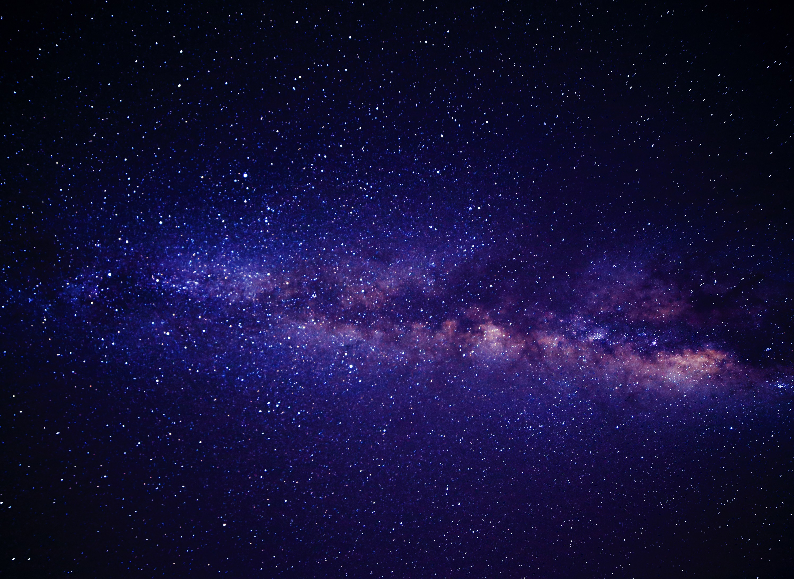
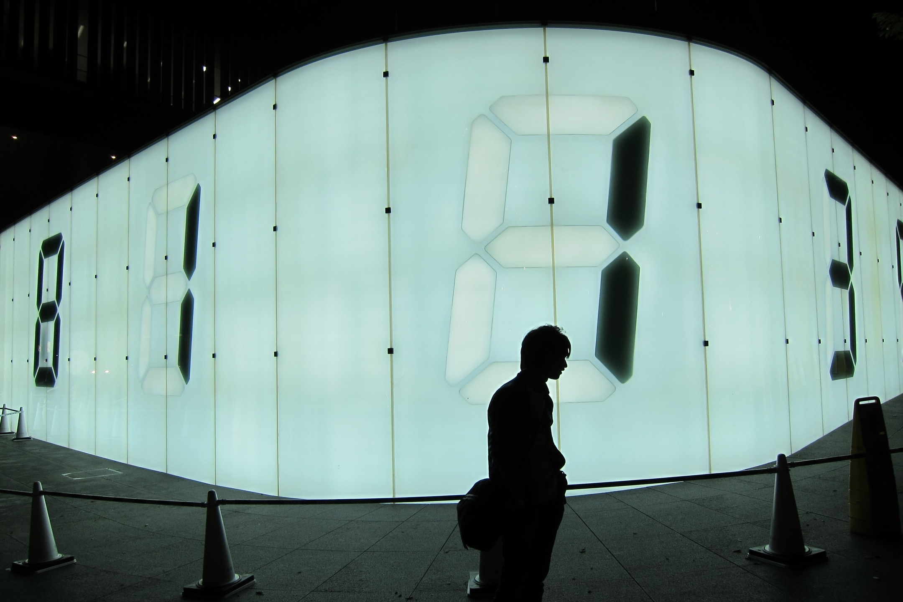

My mom gave me a book called “A Beautiful Question” by Frank Wilczek as a gift over the holidays last year. I’ve only recently had the time to start reading it, and it is so good! The book opens with the question that is the title of this post: Does the World Embody Beautiful Ideas?  The author explores the idea that mother nature is herself an artist given to expressing beauty in her own inimitable style.  If an art historian were to characterize mother nature's aesthetic, he would say it is marked by structural symmetry, repetition, and pattern.  

It is interesting to contemplate these ideas and think about familiar concepts in novel ways.  Reading this book reminds me of the first time I had a major perspective shift in the way I thought about numbers and mathematics.  It was one day during my time in college.  I was on the way to campus from my dorm when I ran into a classmate.  I’ll call him "Caesar" to shield his actual name from public eyes.

I knew Caesar from a painting class I was taking that semester.  Throughout my time in college, I took various math and art classes and majored in both areas.  I do not remember what his major was, but I seem to recall he was neither a math nor an art major.  He was just one of those people with a broadly curious mind.  Somehow we got into a discussion about numbers during our walk.  At some point in the conversation, he said something to the effect of “I always thought of numbers as elements on the periodic table.”  In that moment, it clicked for me  that numbers were also objects that could be studied for their own individual properties and interactions with other numbers.  What if I thought of math class as chemistry class?

I’ll never forget that conversation because up until that moment, I had been engaging with numbers at such a surface level. Even though I was broadening my exposure to mathematics by taking classes, I was missing a very beautiful aspect of the study of numbers and patterns. Caught up in memorizing recipes for how to calculate this or that, I did not see how numbers were objects to be observed and explored like the subjects in the still life paintings we worked on in class.

Frank Wilczek's book promises to present more of these perspective shifting ideas.  I look forward to discovering what it has in store.  Thank you mom for such a great present!  Thank you Caesar for opening my mind to a new way of thinking!